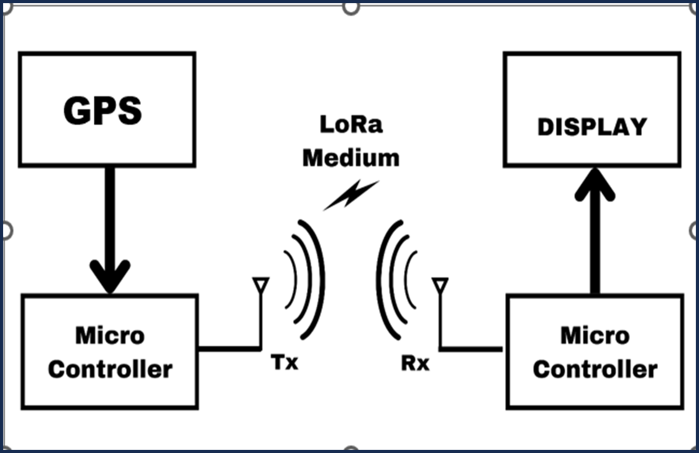
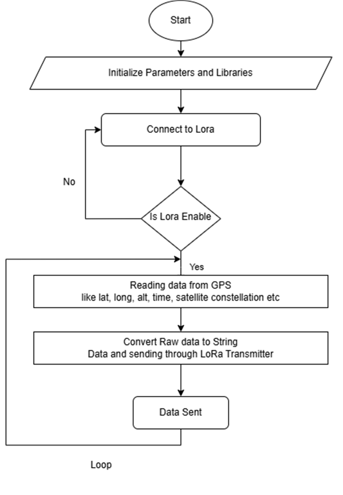
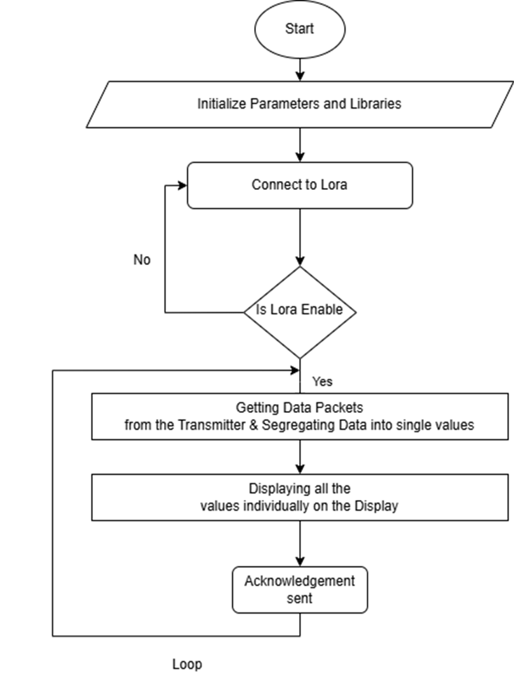
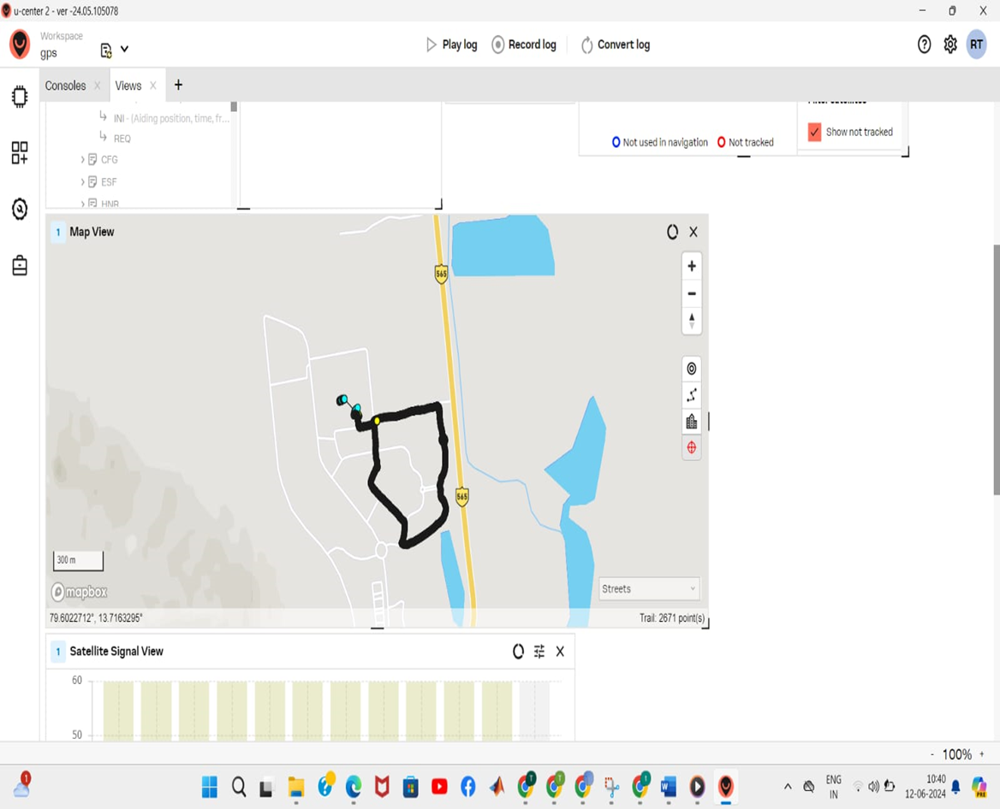
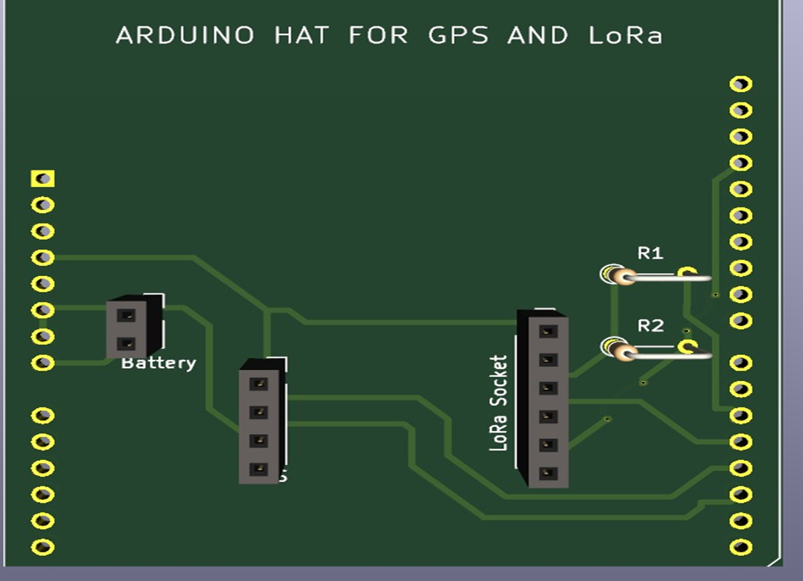

# 🚀 LoRa GPS Transmitter-Receiver Project

This project uses **LoRa modules and GPS** to transmit real-time latitude and longitude data from a **transmitter** to a **receiver**. The receiver processes and displays the data on an **OLED screen**.

## 📌 Features
- 🛰️ **Real-time GPS tracking** with TinyGPS++.
- 📡 **LoRa-based wireless communication** between TX & RX.
- 📺 **OLED Display** for real-time data visualization.
- 🔄 **Data parsing & validation** on receiver side.
- 🛠 **Configurable LoRa settings** (Addressing, Network ID).

---

## 📷 Project Images

### **📡 Network Architecture**


### **🔁 Transmitter Flowchart**


### **📥 Receiver Flowchart**


### **🛰️ GPS Module Setup**


### **🛠 PCB Design**


---

## 🔧 **Hardware Requirements**
| Component            | Quantity |
|----------------------|----------|
| 🛰️ GPS Module (NEO-6M)  | 1        |
| 📡 LoRa Module (E32) | 2        |
| 🔵 Arduino UNO/Nano  | 2        |
| 🖥 OLED Display (128x64) | 1        |
| 🔌 Jumper Wires      | As needed |

---

## 🖥️ **Software Requirements**
- Arduino IDE
- TinyGPS++ Library
- U8g2 Library (for OLED)
- SoftwareSerial Library

---

## 🚀 **Installation & Setup**
### **1️⃣ Wiring the Transmitter**
| **Arduino** | **GPS Module** | **LoRa Module (E32)** |
|------------|-------------|-------------------|
| **TX (D3)** | RX         | M0 → LOW, M1 → LOW |
| **RX (D4)** | TX         | VCC → 3.3V, GND → GND |
| **VCC (3.3V)** | VCC | TX → D8, RX → D9 |

### **2️⃣ Wiring the Receiver**
| **Arduino** | **LoRa Module (E32)** | **OLED Display** |
|------------|-------------------|-----------------|
| **TX (D2)** | RX | SDA → A4, SCL → A5 |
| **RX (D3)** | TX | VCC → 3.3V, GND → GND |

---

## 📜 **Code Implementation**
### **📤 Transmitter Code**
```cpp
#include <TinyGPSPlus.h>
#include <SoftwareSerial.h>

// Define SoftwareSerial for LoRa
SoftwareSerial loraSerial(8, 9); // RX, TX

TinyGPSPlus gps;

void setup() {
  Serial.begin(9600);
  loraSerial.begin(9600);

  // Set LoRa parameters
  loraSerial.println("AT+ADDRESS=1");
  delay(1000);
  loraSerial.println("AT+DESTINATION=2");
  delay(1000);
  loraSerial.println("AT+NETWORKID=6");
  delay(1000);
}

void loop() {
  while (Serial.available() > 0)
    if (gps.encode(Serial.read()))
      sendLocation();
}

void sendLocation() {
  if (gps.location.isValid()) {
    String gps_data = String(gps.location.lat(), 6) + "/" + String(gps.location.lng(), 6);
    String command = "AT+SEND=2," + String(gps_data.length()) + "," + gps_data;
    loraSerial.println(command);
    delay(2000);
  } else {
    loraSerial.println("AT+SEND=2,7,Invalid");
    delay(500);
  }
}
